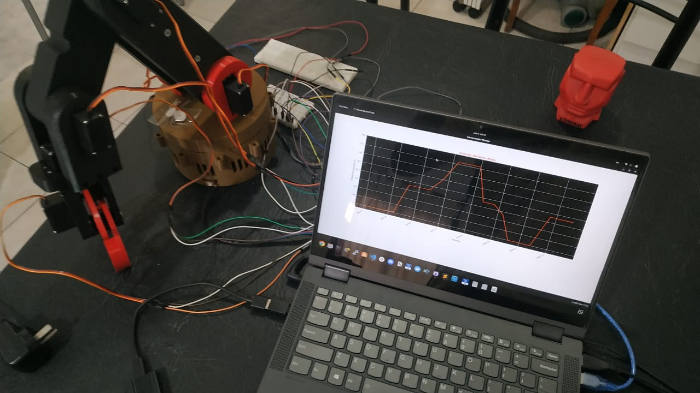
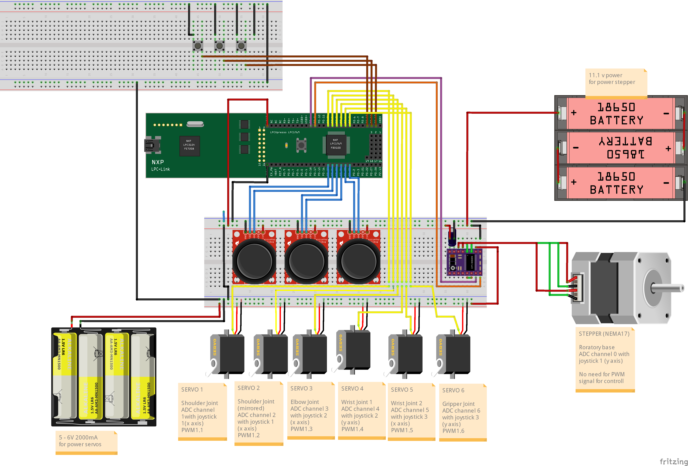

#   3D Printed Robotic Arm Using LPC1769 Microcontroller with Nema 17 stepper motor and MG996R servomotors + Python script for UART data plotting 
This work corresponds to the final project for the Digital Electronics 3 subject in FCEFyN - UNC, Argentina 2022

- IDE: [MCUXpresso IDE](https://www.nxp.com/design/software/development-software/mcuxpresso-software-and-tools-/mcuxpresso-integrated-development-environment-ide:MCUXpresso-IDE).
- Language: C , Python.
- Microcontroller: [LPCXpresso LPC1769 rev C](https://www.embeddedartists.com/products/lpc1769-lpcxpresso/).
- Library: adjunted
- Hardware Bloks in use: ADC, PWM, GPIO, EXTINT, UART, DMA.
---
## How it Works
The working frquuency of the microcontroller is set to 10 MHz by making a small change in the SystemInit() function provided by the provided driver library.
In first place a series of functions for the intial configuration of the pins are called in the main program, this functions are:
  - configGPIO(): sets P2.4 and P2.5 as GPIO ouput pins which will output square signals to indicate the directon of rotation of the stepper and for        triggering a new step in that direction 
  - configADC(): sets P0.23, P2.24, P2.25, P2.26, P1.30, P1.31, P0.2 as AD0-AD7 inputs for reading the analog values of the 3 joysticks (2 channel per joystick but  ADC channels 1 and 2 are connected to the same joystick pin).ADC channels 0-6 are enabled and also it's interruptions and interrupt vector. The ADC is initialized with a peripheral clock division of /8 archiving an ADC working frequiency of 1.25 MHz, the 8 CLKDIV bits of the dedicated freqcuency divisor of the ADC are automatically set to 161, this will achive an ADC sampling rate of 120Hz, and since there are 7 ADC channel enabled we will have near 18 samples/s for each channel.
  - configUART(): configures the UART TX pin P0.2 and sets the transsmition details such as baudrate, parity bits, etc. 
  - configPWM(): sets pins P2.0-P2.5 as PWM1-PWM6 pins which will send the signal for controlling the servos. This function loads the MR0 register of the PWM module with the required value for generating a 20ms period signal needed for the servos. The rest of the match registers (MR1-MR6) of the PWM module are being updated with the corresponding value each time a new ADC read of the associated channel is finished. For exaple: if ADC channel 1 reads the value 2048 this value will first be mapped to a value of 90 (degrees) wich will later be affected by a constant of proportionality for charging the MR1 register of the PWM module with such a value that the pulse widht of the 20 ms signal will be 1.5 ms and the signal will be rotation of the servo will be 90°.
  - configEINTX():  sets pins P2.10-P2.12 as external interrupts using push buttons, P2.1O will toggle between two different modes of controll, P2.11 will toggle enabling and disabling the ADC interrupts and P2.11 will select wich channel data must be sended via UART for visualizing the plot of the position.
  - configDMA(): sends a welcome message to the python script via UART
  - map(): maps the analog value converted by the ADC to a digital value in the range 0-4095 to a value in the range 0-180
  - Servo_Write(): updates the value of the match registers of the PWM module, allowing to update the position of each servo motor
  - accure_move(): allows to use a "digital-like" controll of the servos, only using the ADC convertions to decode the position in which the joystick is placed.
---

## Some images..
 
 

---
## 3D Model
- The 3D model of the robotic arm used for this project was designed by LimpSquid (https://github.com/limpsquid) and you can find it in his Thingiverse profile: https://www.thingiverse.com/limpsquid/designs
---

## Team: Segmentation Fault
Autors: @camilacareggio @ccasanueva7 @francoriba
 
e-mail: franco.riba@mi.unc.edu.ar
